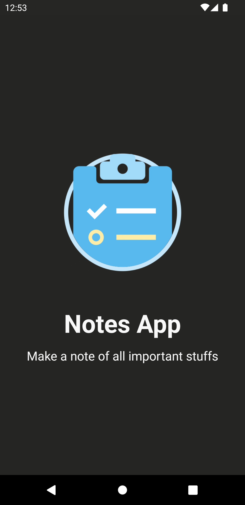
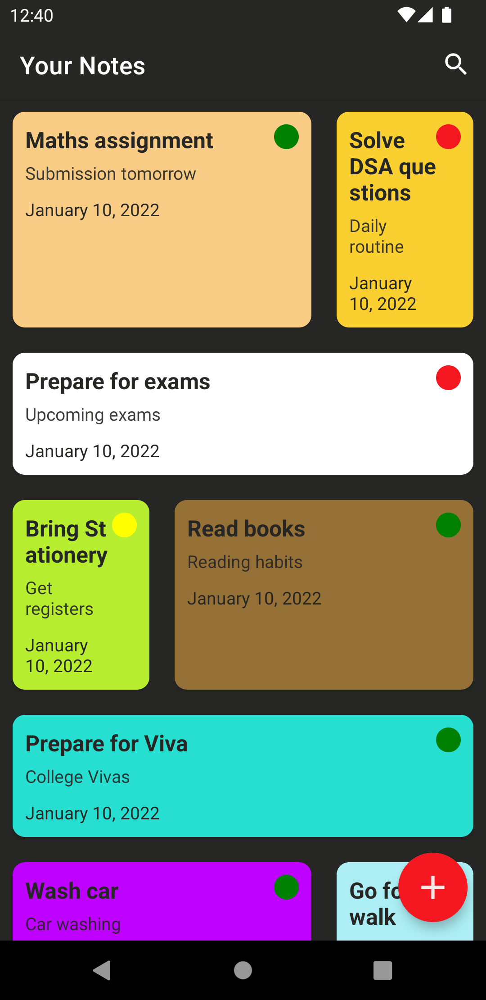
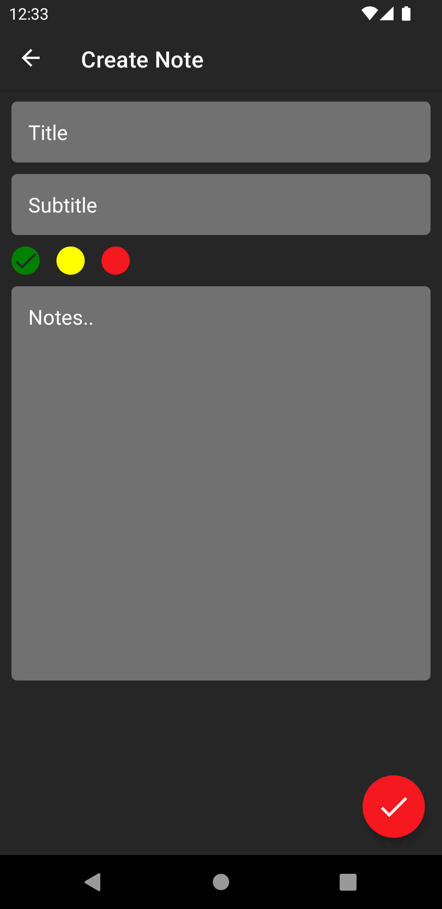
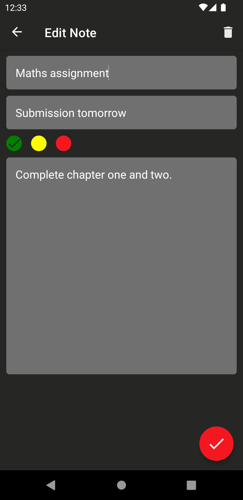
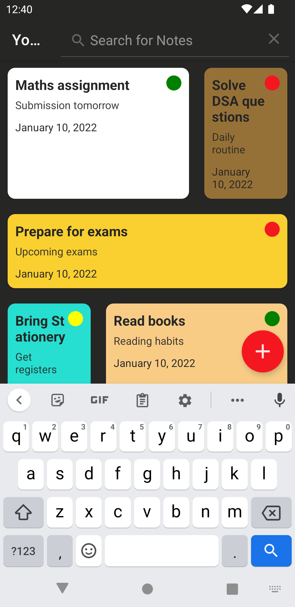
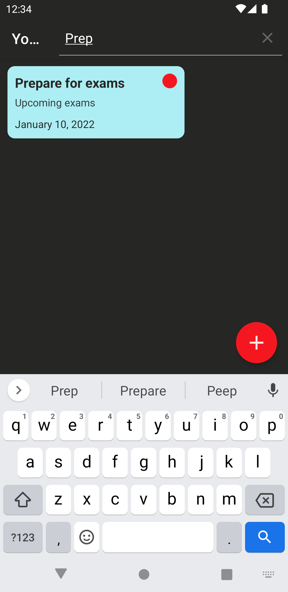

  

### Notes App

 A simple note making app made with kotlin

---

## **Problem Statement**

Every day, we are given a large number of duties to accomplish; we complete some of these jobs and leave the others for the next day. As humans, we have a proclivity for forgetting things, and as a result, we frequently overlook critical tasks or responsibilities. This puts us in a terrible scenario where we only have one thought: "Only if I could have written it down somewhere."

## **Solution**

In such cases, note-taking comes in helpful, as it allows us to keep track of all the tasks that have been assigned to us without the worry of forgetting them. The notes are saved locally, which protects them from being misplaced and allows for quick access. You can prioritise work on the app, which aids us in determining which task to complete first and therefore boosts our efficiency. It also assists us in reaching our objectives, ensuring that we never miss an opportunity.

## **Screenshots**

## **Functionality & Concepts used**

The App has a very simple and interactive ui which make it easier to understand the flow of the app. Following are few android concepts used to achieve the functionalities in app :

- `Diffrent screen layouts` : The project employs a variety of layouts, each of which provides unique functionality and aids in the UI's ability to work across a wide range of screen sizes (Example : Linear Layout, Constraint Layout, Frame Layout).
- `Recyclerview` : We selected recycler view to exhibit the list of distinct notes because it efficiently displays a large number of things..
- `MVC Architecture` : We adopted the MVC design, which improves code testability and makes it easier to add new features by emphasising the separation of concerns.
- `LiveData & Room Database` : We are using LiveData to update & observe any changes in the notes and update it to local databases using Room.
- `Android Jetpack Navigation` : We also use Android Jetpack Navigation, which simplifies navigation implementation while also assisting us in visualising the navigation flow of our application.

## **Application Link & Future Scope**

The application is currently in the Alpha testing phase at GDSC IIIT KOTA with a limited no. of users. You can access the pre-release of our app from the [releases](https://github.com/MrMischievousX/Notes-App/releases/tag/v1.0) section.

Only CRUD operations are currently supported by the application alongwith search functionality. We also intend to include an alarm that will serve as a reminder for all of our chores. We also intend to employ an online database that will allow us to view our notes from any device while also providing user verification.
